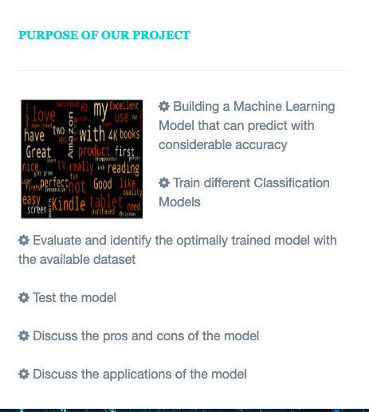
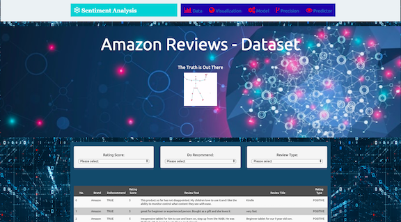
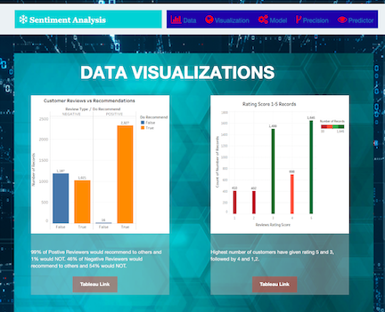
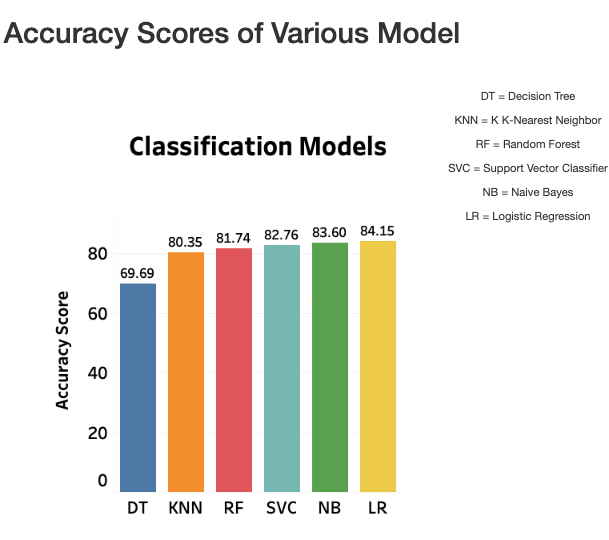
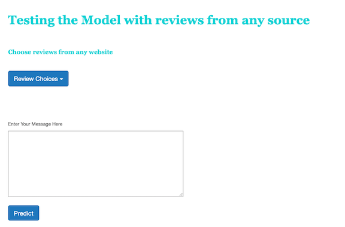
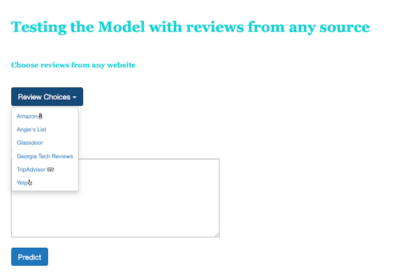
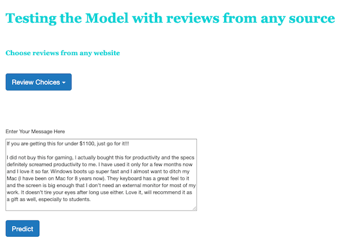
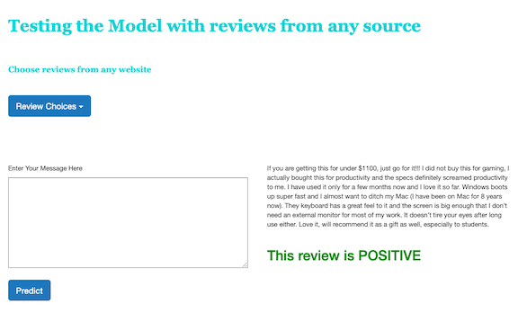

# Predict-MyReview 

## Contributors :
George Oddoye, Minu Khosla, Vidhyanandhi Jegannathan

## Purpose :
Our purpose was to build a NLP machine learning project designed to create a model that can predict if a review is positive or negative.

### Dependencies :

* from flask import Flask, jsonify, render_template,url_for,request
* import pickle
* from sklearn.feature_extraction.text import TfidfVectorizer
* from sklearn.linear_model import LogisticRegression
* from sklearn.model_selection import train_test_split
* from sklearn.naive_bayes import MultinomialNB
* from sklearn.externals import joblib

### Our Dataset was an amazon reviews dataset from kaggle.com https://www.kaggle.com/datafiniti/consumer-reviews-of-amazon-products. 
The dataset contained a list of over 34,000 reviews of Amazon products like the Kindle, Fire TV, ect. It had 21 columns ranging from product asin to the date when review was added. The columns we were concerned about, in regards to the model, were "reviews.text" and "reviews.rating".

###  We created Data Table with filters to showcase, view and study the data.

           
### We created data visualizations to better explain the data.

### Classification Models were trained and tested.

### TESTING THE MODEL :
#### We created the Predictor Page that could take any review as an input .
___________________________________________________________________________

___________________________________________________________________________

#### The user can select any website from the dropdown menu to get a review.

___________________________________________________________________________

_________________________________________________________________________

#### The user can input selected review OR type in their own custom review.

__________________________________________________________________________

___________________________________________________________________________

#### Hitting the "Predict Button" will show the result if the review is positive or negative.

___________________________________________________________________________

___________________________________________________________________________

 
 
